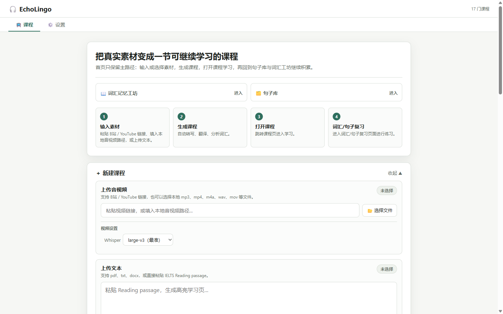
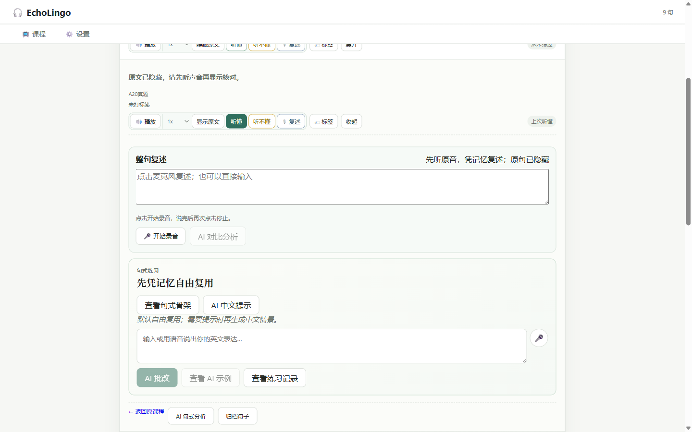
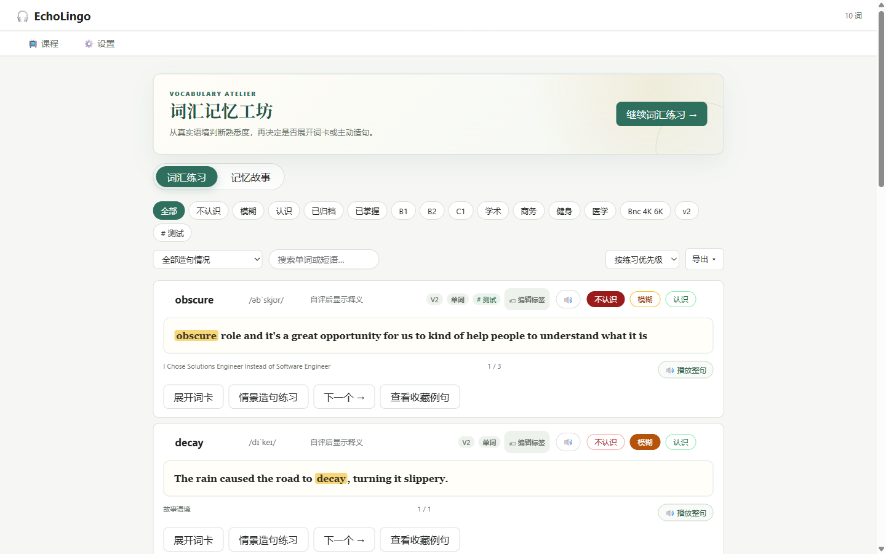

# EchoLingo

**中文文档 → [README.zh-CN.md](README.zh-CN.md)**

**Local-first, self-hosted English learning workspace**: turn your own videos, podcasts and articles into interactive lessons — listen with hidden-original drills, retell with AI feedback, drill reusable sentence patterns, and review vocabulary. Local Whisper transcription, local translation, an offline ECDICT dictionary, and any OpenAI-compatible LLM.

本地优先、可自托管的英语学习工作台：把自己的视频 / 播客 / 文章变成交互式课程——隐藏原文精听、整句复述 + AI 对比、句式提取复用 + AI 批改、词汇复习一站完成。本地 Whisper 转写、本地翻译、内置 ECDICT 离线词典，AI 兼容任意 OpenAI 接口。

## Why EchoLingo

- **Your data stays home** — lessons, vocab DB and caches live on your machine; no account, no subscription
- **Real materials, not canned courses** — learn from the content you actually care about
- **Input → output loop** — hidden-original listening drills → whole-sentence retelling with AI comparison → sentence-pattern reuse with AI correction → vocabulary memory stories
- **Pluggable AI** — DeepSeek, OpenAI, Groq, Ollama or any OpenAI-compatible endpoint; transcription, translation and dictionaries run fully local

## Screenshots

| | |
|---|---|
|  |  |
|  |  |

## How it works

1. **Create a lesson** from a YouTube/Bilibili link, an article URL, a local video/audio file, or pasted text. Subtitles are fetched or transcribed locally with faster-whisper, segmented into sentences, translated, and annotated with IPA and connected-speech notes.
2. **Study the lesson** sentence by sentence: loop playback, click any word for offline dictionary entries (built-in ECDICT), get AI hints, and save useful sentences and words with one click.
3. **Review in the sentence library**: hide the original and listen first, mark 听懂/听不懂, then speak a full-sentence retelling — AI compares your version with the original. Extract the reusable sentence pattern and drill it: write your own sentence, get AI correction with a revision and a more idiomatic alternative.
4. **Review vocabulary** with a familiarity lifecycle (unknown → fuzzy → known → mastered), AI-generated memory stories with chat, and exports to Markdown / HTML / Anki.

## Features

- **Multiple sources** — YouTube, Bilibili, article URLs, local video/audio, plain text/Markdown
- **Lesson generation** — subtitle fetching or local faster-whisper transcription, sentence segmentation, translation, IPA annotation, connected-speech and oral analysis
- **Interactive lesson pages** — listening & reading dual modes, per-sentence loop playback and intensive study, built-in offline ECDICT lookup, one-click saving of words and sentences while watching
- **AI viewing companion** — AI-generated content outline for one-click topic jumps; ask the AI questions mid-video with the current sentence as context
- **Sentence library** — collect sentences from lessons or AI output, listening practice with hidden original, spoken retelling with AI comparison, and pattern drills graded by AI with revision + idiomatic suggestions
- **Vocabulary system** — built-in frequency & exam wordlists (Oxford 3000, COCA top 2K/5K, CET-4/6, 考研, IELTS, TOEFL, GRE) generated locally from ECDICT, word highlighting, personal vocab book with frequency-prioritized review lifecycle, AI memory stories with chat, and exports (Markdown / HTML / Anki)
- **Local-first** — lessons, vocab DB, and caches stay on your machine; AI features work with any OpenAI-compatible API (DeepSeek, OpenAI, Groq, Ollama, …)

## Quick Start

Requires Python 3.11+ and [ffmpeg](https://ffmpeg.org/) on PATH. See **System Requirements** below for hardware notes.

```bash
git clone https://github.com/shine11224/EchoLingo.git
cd EchoLingo
python -m venv .venv
.venv\Scripts\activate        # Windows
# source .venv/bin/activate   # macOS / Linux
pip install -r requirements.txt
# ECDICT is bundled and ready to use; no separate dictionary build is needed.
```

Optional — high-quality PDF reflow via [Docling](https://github.com/docling-project/docling) (better reading order for two-column/mixed-layout PDFs):

```bash
pip install -r requirements-optional.txt  # ~2GB incl. torch; models download on first use
```

Without it, PDF import falls back to the built-in geometric text extraction. Set `ELT_DOCLING=off` to disable even when installed.

Configure API keys:

```bash
cp .env.example .env          # then edit .env — AI_API_KEY is enough to start
```

Start the server:

```bash
python backend/fastapi_server.py
# open http://localhost:5173
```

## Usage guide

**First lesson**: paste a YouTube or Bilibili link on the home page and create a lesson. Short clips (2–10 min) work best for intensive study. Local files and article URLs work the same way.

**Lesson page**: click a sentence to loop it; click a word to look it up and add it to the Vocabulary Workshop; use the AI panel for translation, grammar hints and Q&A about the current sentence.

**Sentence library** (home page tab): every sentence you save lands here. Recommended daily flow:

1. **Listen** — original hidden by default; play the audio, then mark 听懂 / 听不懂
2. **Retell** — open 🎙 复述, speak the sentence from memory; AI compares your retelling with the original across accuracy, missing content, grammar and expression
3. **Pattern drill** — extract the sentence's reusable pattern, write your own sentence with it (or get an AI Chinese scenario prompt), then let AI grade it with a revision and a more idiomatic alternative — you can favorite those AI sentences too

**Vocabulary** (home page tab): review cards stay context-first — rate yourself before revealing the meaning. Generate an AI memory story from today's words when you want narrative reinforcement, and export any time (Markdown / HTML / Anki).

**Settings** (in-app): the settings page writes the same `.env` file — AI provider presets, API keys, Baidu Drive setup, Whisper model size and wordlists can all be changed without editing files by hand.

## System Requirements

- **OS** — Windows 10/11, macOS 12+, or Linux
- **Runtime** — Python 3.11+, ffmpeg on PATH
- **RAM** — 8 GB minimum; 16 GB recommended when running local Whisper
- **GPU (optional)** — an NVIDIA GPU with ≥6 GB VRAM makes large-v3 transcription several times faster; CPU-only works fine with the base/medium models, or set `GROQ_API_KEY` for fast cloud transcription
- **Disk** — ~2 GB for the app, ~90 MB for the bundled ECDICT dictionary, plus 1–3 GB per Whisper model and lesson caches
- **Microphone** — needed for the spoken-retell feature; a modern browser (Chrome/Edge recommended)

## Configuration

All settings live in `.env` (or the in-app Settings page, which writes the same file). Only `AI_API_KEY` is needed for AI features; everything else degrades gracefully:

- `AI_API_KEY` / `AI_BASE_URL` / `AI_MODEL` — any OpenAI Chat Completions-compatible API. The Settings page includes presets for DeepSeek Flash, Kimi Platform and Kimi Code.
- `GROQ_API_KEY` — optional, fast cloud transcription with a **free daily tier**; get a key at [console.groq.com/keys](https://console.groq.com/keys) (local Whisper works without it)
- Baidu Drive — every user authorizes their own account locally. Install `bdpan`, complete OAuth from Settings, then re-run the capability check; see `docs/BAIDU_PAN.md`.
- Local translation — drop a Tencent HY-MT1.5 GGUF into `models/` plus llama.cpp's `llama-server` into `llama-cpp/`; the model is governed by the [Tencent HY Community License](https://github.com/Tencent-Hunyuan/HY-MT/blob/main/License.txt) (not available in the EU/UK/South Korea), see `THIRD_PARTY_LICENSES.md`
- Built-in dictionary — the ready-to-use [ECDICT](https://github.com/skywind3000/ECDICT) (MIT) SQLite database is bundled; `python backend/build_ecdict.py` is only needed when refreshing it; see `docs/DICTIONARIES.md`
- Built-in wordlists — frequency/exam wordlists generated from ECDICT are bundled and automatically regenerated when needed; third-party wordlists (BNC/COCA, BSL, NAWL…) are not bundled, see `docs/WORDLISTS.md`

## Documentation

- `docs/WORDLISTS.md` — where to get wordlists and how to compile them
- `docs/DICTIONARIES.md` — the built-in ECDICT dictionary
- `docs/BAIDU_PAN.md` — per-user Baidu Drive installation, authorization and troubleshooting

### OpenAI-compatible provider presets

| Provider | Base URL | Model |
| --- | --- | --- |
| DeepSeek Flash | `https://api.deepseek.com` | `deepseek-v4-flash` |
| Kimi Platform | `https://api.moonshot.cn/v1` | Choose a model ID available in your Platform console |
| Kimi Code | `https://api.kimi.com/coding/v1` | `kimi-for-coding` |

Kimi Platform and Kimi Code are separate services with different keys and billing. Do not mix a Kimi Platform key with the Kimi Code Base URL, or vice versa. Custom OpenAI-compatible gateways remain supported by entering their Base URL and model ID manually.

## License

[PolyForm Noncommercial 1.0.0](LICENSE) — free for personal, educational and non-profit use; commercial use requires a separate license from the author. Third-party components remain under their own licenses, see [THIRD_PARTY_LICENSES.md](THIRD_PARTY_LICENSES.md).
