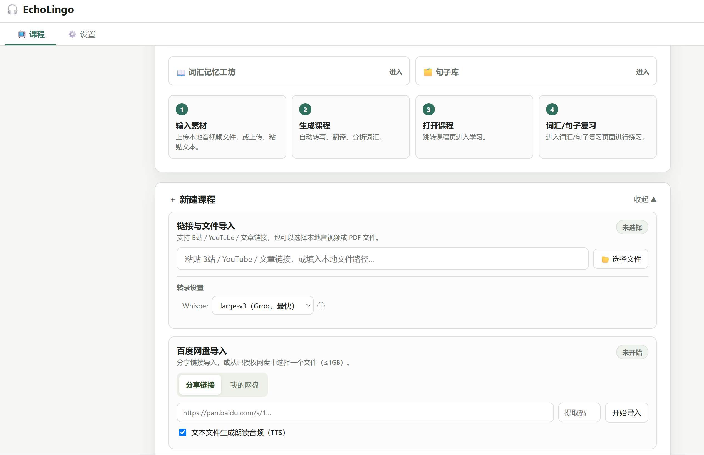
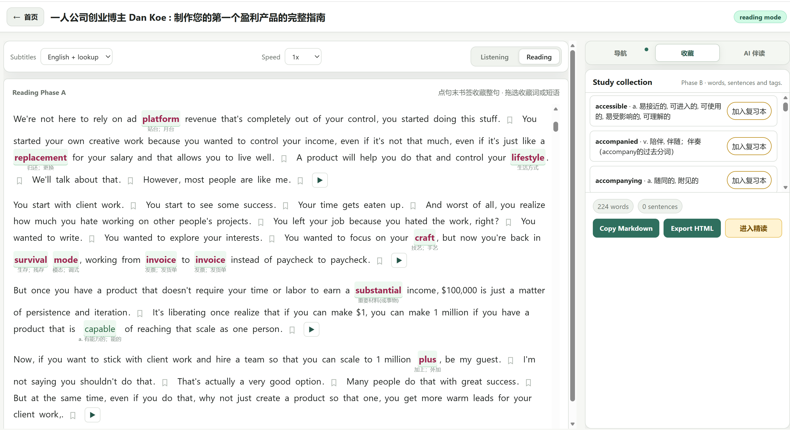
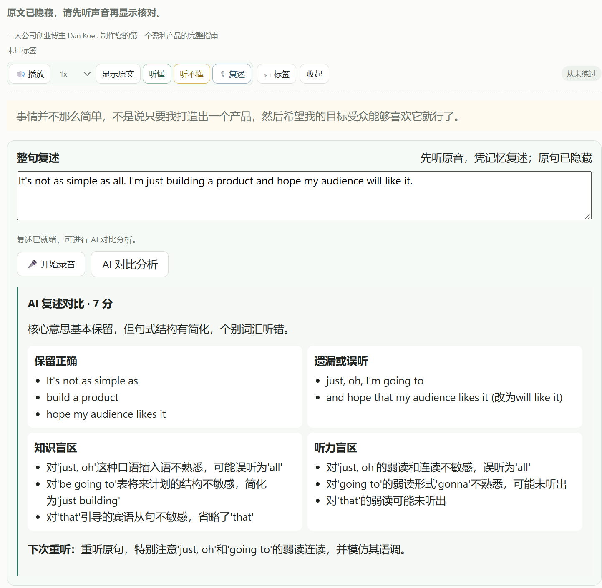
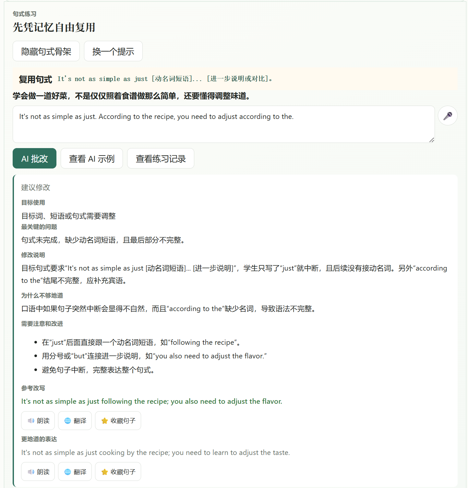
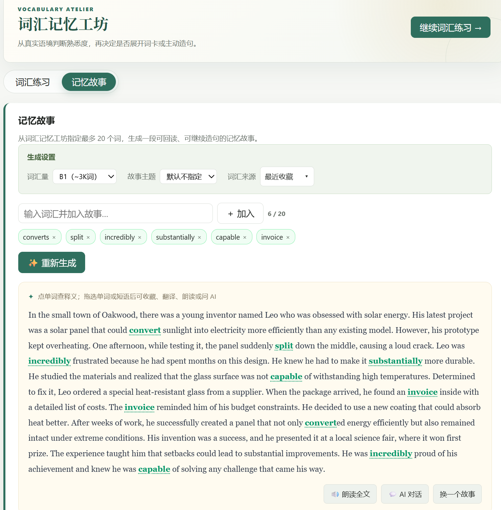

# EchoLingo

Turn English videos, audio, and articles you genuinely care about into personal lessons for listening, close reading, practice, and review.

[简体中文](README.zh-CN.md) · [Quick Start](#quick-start) · [Installation](#installation-and-configuration) · [Features](#features) · [Troubleshooting](#troubleshooting) · [Documentation](#documentation)

> EchoLingo is an open-source, local-first learning tool for individual learners. It keeps the original audio, sentences, and context at the center, then uses AI for organization, explanation, and feedback.



## Quick Start

```bash
git clone https://github.com/shine11224/EchoLingo.git
cd EchoLingo
python -m venv .venv        # macOS: python3.11 -m venv .venv  (see Requirements)
source .venv/bin/activate   # Windows PowerShell: .\.venv\Scripts\Activate.ps1
pip install -r requirements.txt   # first run downloads several GB; 20–30 min is normal
cp .env.example .env        # Windows: Copy-Item .env.example .env
python backend/fastapi_server.py  # then open http://localhost:5173
```

Requires Python 3.11 and FFmpeg. Per-platform details: [Installation and configuration](#installation-and-configuration).

## Platform support

| Capability | Windows | macOS | Linux |
| --- | --- | --- | --- |
| Course import, listening, reading, vocabulary | ✓ | ✓ | ✓ |
| Local Whisper / Groq transcription | ✓ | ✓ | ✓ |
| Scanned-PDF OCR (Tesseract / EasyOCR) | ✓ | ✓ | ✓ |
| One-click local translation (HY-MT) | ✓ | manual setup | manual setup |
| Ready-made Release package | ✓ | — (install from source) | — (install from source) |

## Why EchoLingo exists

I had saved plenty of English courses, YouTube and Bilibili videos, and articles, but most of them stayed untouched in bookmarks and cloud drives. When I did open them, one-click translation made it easy to understand the topic without learning to recognize the sounds or produce the language myself.

EchoLingo began with a small idea: turn English content I already wanted to watch into lessons that support sentence-by-sentence playback, subtitle comparison, and repeated listening. Over time, that became a complete learning loop:

**Choose interesting material → understand the audio → learn words in sentences → study useful expressions → retell and write → review in context**

The design follows five principles:

1. **Understand first.** Build the connection from sound to word to meaning before moving into detailed analysis.
2. **Learn words in sentences.** Lookup, collection, and review should lead back to the sentence where a word was first encountered.
3. **Let interest drive the material.** Content you already want to understand is easier to return to consistently.
4. **Keep the difficulty at i + 1.** Subtitle modes and custom wordlists let you control how much support appears at each stage.
5. **Learn through use.** Retelling, contextual sentence writing, and feedback move learning from recognition toward production.

AI is not the learner here. It builds navigation, explains language, organizes study points, and offers feedback; the original audio, the original sentence, your judgment, and your output remain the core of the process.

## Learning flow

### 1. Import material you want to learn from

EchoLingo accepts YouTube, Bilibili, article URLs, local audio and video, text and PDF files, plus optional Baidu Drive imports. Course generation uses the transcription, translation, and wordlist options you configure.

### 2. Understand the audio first

Listening mode provides sentence playback, speed control, looping, and sentence collection. You can move among audio-only listening, Chinese subtitles, English subtitles, bilingual subtitles, and English subtitles with vocabulary hints. A useful sequence is to listen first, confirm meaning in Chinese, return to English to locate missed sounds and expressions, and only then open detailed hints—but the order is entirely configurable.


### 3. Read in the complete context

Reading mode keeps the full transcript together. Any sentence can replay the original audio; a passage can play continuously; words can be looked up; sentences can be saved; and enabled wordlists appear as contextual highlights.



### 4. Study vocabulary, pronunciation, and patterns

Intensive study expands each sentence into phonetics, stress and linking, focus vocabulary, spoken expressions, and reusable sentence patterns. AI can suggest study points from the material, but its analysis should still be checked against the source and a dictionary.


### 5. Produce language through retelling and writing

Saved sentences can become full-sentence retelling exercises: listen, hide the source, retell from memory, and let AI compare omissions or misheard parts. Reusable patterns can also become contextual writing prompts with corrections, rewrites, and more natural alternatives.

<p>
  
  
</p>

### 6. Review vocabulary in its original sentence

The Vocabulary Atelier filters words by familiarity, mastery, frequency, exam list, and custom tags. Each entry keeps the source sentence and audio and can expand into a word card or contextual writing exercise. Several words can also be combined into a memory story, placing isolated vocabulary back into understandable context.

<p>
  
  
</p>

## Features

### Works without an API key

EchoLingo is useful before you configure any AI provider. The bundled ECDICT dictionary (definitions, IPA, frequency, and inflections), the bundled general-frequency, CET, postgraduate exam, IELTS, TOEFL, GRE, and COCA wordlists, listening and reading modes, sentence collection, and your local learning data all work without a key. AI outlines, Q&A, deep analysis, correction, and story generation require `AI_API_KEY`. Whether transcription and translation use the network depends on the local or cloud options you select.

### Material and course creation

- YouTube, Bilibili, and regular article URLs
- Local audio, video, TXT / Markdown, DOCX, and PDF files
- Automatic PDF routing: text-layer extraction first, then Tesseract OCR for scanned pages and optional EasyOCR escalation for low-confidence results
- Optional Baidu Drive share links or app-data browsing
- Text-to-speech audio for text material
- Local Whisper or Groq cloud transcription
- Chinese subtitle generation through local HY-MT or a configured service

### Listening and reading

- Audio-only, Chinese, English, bilingual, and English-with-vocabulary modes
- Sentence playback, continuous playback, looping, and speed control
- Click-to-lookup subtitles, sentence collection, and custom tags
- AI-generated outline and timestamp navigation
- Ask AI about selected subtitles and export the conversation

### Vocabulary and sentence study

- Bundled ECDICT definitions, IPA, frequency, and inflections without an API key
- Bundled general-frequency, CET, postgraduate exam, IELTS, TOEFL, GRE, and COCA lists
- Upload `.txt` or `.csv` wordlists and optionally expand common inflections
- Automatically highlight enabled wordlists in later lessons
- Word cards, synonyms, collocations, examples, and source-example filtering
- Sentence-pattern, spoken-expression, and pronunciation analysis

### Output and review

- Full-sentence listening retells with AI comparison
- Contextual writing, pattern reuse, AI correction, and reference rewrites
- Familiarity, mastery, tag, exam-list, and frequency filters
- Multi-word memory stories, read-aloud, and follow-up writing
- Markdown, HTML, CSV / JSON / TXT, and Anki vocabulary exports

## Installation and configuration

### Requirements

- Python 3.11 — verify with `python --version`. If your system only has an older `python3` (common on macOS), install 3.11 first, e.g. `uv python install 3.11` (then create the environment with `uv venv --python 3.11`), Homebrew, or python.org.
- Git
- [FFmpeg](https://ffmpeg.org/download.html) for audio and video processing; make sure `ffmpeg` is on `PATH`, or set `FFMPEG_PATH` to the executable's full path.
- A modern browser
- Optional: an NVIDIA GPU. CPU-only systems can use smaller local Whisper models, or Groq transcription can be configured instead.

### 1. Clone and install

```bash
git clone https://github.com/shine11224/EchoLingo.git
cd EchoLingo
```

Windows PowerShell:

```powershell
py -3.11 -m venv .venv      # or: python -m venv .venv
.\.venv\Scripts\Activate.ps1
pip install -r requirements.txt
Copy-Item .env.example .env
```

macOS / Linux:

```bash
python3.11 -m venv .venv    # any command that gives you a Python 3.11 interpreter
source .venv/bin/activate
pip install -r requirements.txt
cp .env.example .env
```

The first `pip install` downloads several GB (PyTorch and other large packages) and typically takes 20–30 minutes. A long quiet stretch is normal, not a hang.

### 2. Configure an AI provider

Edit `.env`, or enter the same values in the in-app Settings page after startup:

```dotenv
AI_API_KEY=your_key
AI_BASE_URL=https://api.deepseek.com
AI_MODEL=deepseek-v4-flash

# Optional: Groq cloud Whisper transcription
GROQ_API_KEY=

# Optional: local MDX dictionaries; bundled ECDICT needs no configuration
DICT_DIR=
```

`AI_API_KEY` powers outlines, AI reading assistance, language analysis, correction, and memory stories. EchoLingo calls OpenAI Chat Completions-compatible APIs. Settings includes presets for DeepSeek, Qwen, Kimi Platform, and Kimi Code, and also accepts a custom Base URL and model ID.

> Provider model names and regional availability can change. Confirm the current model ID in your provider console. Kimi Platform and Kimi Code use different endpoints and keys and must not be mixed.

### 3. Start EchoLingo

```bash
python backend/fastapi_server.py
```

Open [http://localhost:5173](http://localhost:5173). On first run, visit Settings and verify the AI, transcription, and translation status before creating a course. The interactive API reference is served at [http://localhost:5173/api/docs](http://localhost:5173/api/docs).

> **Network exposure:** by default the server listens on `0.0.0.0:5173` with no authentication and permissive CORS, so every device on your network can reach it (the startup log prints the LAN address). To keep it on this computer only, set `ELT_HOST=127.0.0.1` in `.env`. Use `ELT_PORT` to change the port.

### Windows Release package

Release assets are currently Windows-only (`EchoLingo-<version>-windows.zip`). On macOS and Linux, install from source as described above.

Each `v*` tag can publish a `EchoLingo-<version>-windows.zip` asset. Extract it
to a folder you own, then run PowerShell from that folder:

```powershell
Set-ExecutionPolicy -Scope Process Bypass
.\installer\install.ps1 -InstallAll
.\installer\start.ps1
```

The package contains the public source and installer scripts, not a private
`.env`, Python virtual environment, native binaries, or model weights. `-InstallAll`
installs Python 3.11, the optional Docling/EasyOCR stack, and the LGPL FFmpeg
shared build plus Tesseract through `winget`. If you want a smaller install, use
`-InstallOptional` and/or `-InstallNativeTools` separately. The installer does
not overwrite an existing `.env` unless `-ForceEnv` is supplied.

## Optional components

### Local Whisper transcription

Open **Settings → Local Whisper** to choose and download a model. Larger models generally improve accuracy but need more disk space, memory, and compute. If no local model is installed, `GROQ_API_KEY` can provide cloud Whisper transcription.

### Local Chinese translation

On Windows x64, Settings can install Tencent HY-MT1.5 and the matching llama.cpp runtime. The installer shows its source, pinned version, and SHA-256 before installation; afterward, Chinese subtitles can be generated locally. HY-MT is governed by the [Tencent Hunyuan Community License](https://github.com/Tencent-Hunyuan/HY-MT/blob/main/License.txt) and has regional restrictions; see [THIRD_PARTY_LICENSES.md](THIRD_PARTY_LICENSES.md).

Without the local translation component, translation requires a configured translation or AI service. macOS and Linux do not currently have the same one-click flow; follow the official llama.cpp and HY-MT instructions for a manual setup.

### Deeper PDF parsing

PDF import uses an automatic route:

1. Use Docling when it is installed; if it is unavailable or cannot extract useful text, fall back to the built-in `pdfplumber` text-layer parser.
2. If no usable text layer is found, render image-only pages and run Tesseract OCR.
3. If Tesseract's confidence is below the configured threshold, use EasyOCR when it is installed.

The default environment includes the lightweight text extraction and Tesseract Python wrapper. Install the optional PDF/OCR stack together when you need scanned-PDF support:

```bash
pip install -r requirements-optional.txt
```

`pytesseract` is only a Python wrapper; install the Tesseract executable separately and put it on `PATH`. EasyOCR is an optional heavier fallback: its recognition models are downloaded on first use. Normal text-based PDFs do not need either OCR backend.

Set `ELT_DOCLING=off` to skip Docling. Set `ELT_OCR_ENGINE=tesseract` or `easyocr` to force one OCR backend, or leave it as `auto` for the route above.

### Baidu Drive

Baidu Drive is optional. Open **Settings → Baidu Drive**, confirm installation of the official `bdpan` component, and finish local OAuth authorization. EchoLingo does not request a Baidu password or browser cookie. Authorization is stored locally by `bdpan`, and access is limited to `/apps/bdpan/`. See [docs/BAIDU_PAN.md](docs/BAIDU_PAN.md) for the complete flow.

## Configuration reference

| Setting | Required | Purpose |
| --- | --- | --- |
| `AI_API_KEY` | For AI features | Outlines, Q&A, analysis, correction, and stories |
| `AI_BASE_URL` | For AI features | OpenAI-compatible API endpoint |
| `AI_MODEL` | For AI features | Model ID |
| `GROQ_API_KEY` | Optional | Groq cloud Whisper transcription |
| `HY_TRANSLATE_API_KEY` | Optional | Separate HY translation service; can be saved in Settings |
| `HY_TRANSLATE_MODEL` | Optional | HY translation model name |
| `DICT_DIR` | Optional | Additional local MDX dictionary directory |
| `ELT_HOST` | Optional | Bind address, default `0.0.0.0` (all interfaces); use `127.0.0.1` for local-only |
| `ELT_PORT` | Optional | Port, default `5173` |
| `ELT_AUTH_ENABLED` | Optional | `1` enables login and multi-user mode in builds that ship the auth modules; the public build always runs single-user without authentication |
| `FFMPEG_PATH` | Optional | Full path to the ffmpeg executable; checked before the bundled copy and `PATH` |
| `ELT_CONFIG_DIR` | Optional | Directory EchoLingo reads `.env` and platform cookie files from; default is the project root |
| `ELT_TIMEZONE` | Optional | IANA timezone for scheduled jobs, default `Asia/Shanghai` |
| `ELT_TTS_CONCURRENCY` | Optional | Parallel TTS workers, default `3` |
| `ELT_MEDIA_UPLOAD_MAX_MB` | Optional | Maximum browser upload size in MB, default `500` |
| `ELT_BAIDU_PAN_ENABLED` | Optional | Set `0` to disable the Baidu Drive integration |
| `ELT_DOCLING=off` | Optional | Disable an installed Docling pipeline |
| `ELT_OCR_ENGINE` | Optional | `auto`, `tesseract`, or `easyocr` for scanned-PDF OCR |
| `ELT_OCR_CONFIDENCE_THRESHOLD` | Optional | Tesseract confidence (0–100) below which auto mode escalates to EasyOCR; default `65` |
| `ELT_OCR_LANG` | Optional | Tesseract language, default `eng` |
| `ELT_EASYOCR_LANGS` | Optional | Comma-separated EasyOCR languages, default `en` |
| `ELT_EASYOCR_GPU` | Optional | EasyOCR GPU mode: `auto`, `true`, or `false` |
| `ELT_EASYOCR_MODEL_DIR` | Optional | Directory for EasyOCR model downloads |

See [Works without an API key](#works-without-an-api-key) for what runs with no `AI_API_KEY` configured.

## Troubleshooting

- **`git clone` fails with `unexpected disconnect while reading sideband packet`.** The connection dropped mid-fetch. Retry, or download a source snapshot instead: `https://codeload.github.com/shine11224/EchoLingo/zip/refs/heads/main`.
- **`python: command not found` on macOS / Linux.** Use the 3.11 interpreter explicitly: `python3.11 -m venv .venv`, or `uv venv --python 3.11`.
- **`pip install` looks stuck.** The first install downloads several GB; 20–30 minutes with little output is normal.
- **`ffmpeg not found`.** Install FFmpeg and make sure it is on `PATH`, or set `FFMPEG_PATH` to the executable's full path. The Windows Release installer can install it for you.
- **Port 5173 is already in use.** Set `ELT_PORT=<free port>` in `.env`.
- **Where are Whisper models stored?** In `~/.cache/huggingface/hub` or the project's `.cache/huggingface/hub`; override with `HUGGINGFACE_HUB_CACHE` or `HF_HOME`.
- **`http://localhost:5173/docs` returns 404.** The API docs were moved: use `/api/docs` (ReDoc at `/api/redoc`, schema at `/api/openapi.json`).

## Data and project boundaries

- The public build is a single-user, local application. It does not include accounts, subscriptions, multi-user collaboration, or cloud sync.
- Lessons, collections, and learning records stay on the computer running EchoLingo. Third-party AI or transcription providers receive the text or audio needed for the request; review the privacy policy of the provider you choose.
- YouTube, Bilibili, and Baidu Drive imports may fail because of login, cookie, regional, or upstream policy changes.
- AI-generated definitions, language analysis, and corrections can be wrong. Check important points against the source and a dictionary.
- Only process content you have the right to use, and follow the source platform's terms and copyright requirements.

## Documentation

- [Dictionaries](docs/DICTIONARIES.md)
- [Wordlists](docs/WORDLISTS.md)
- [Baidu Drive setup](docs/BAIDU_PAN.md)
- [Contributing](CONTRIBUTING.md)
- [Security policy](SECURITY.md)
- [Third-party licenses](THIRD_PARTY_LICENSES.md)
- [Windows release installer](installer/README.md)
- Interactive API reference: `/api/docs` on a running server

## License

[PolyForm Noncommercial 1.0.0](LICENSE): free for personal, educational, and non-profit use. Commercial use requires a separate license from the author. Third-party components remain under their own licenses; see [THIRD_PARTY_LICENSES.md](THIRD_PARTY_LICENSES.md).
